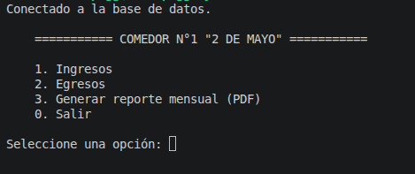
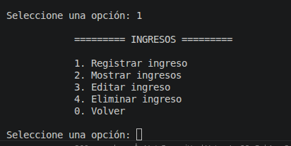
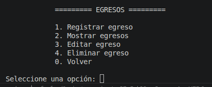

# Comedor Popular 2 de Mayo

Sistema desarrollado en **Python** para gestionar los ingresos y egresos del **Comedor Popular N.° 1 "2 de Mayo"**, utilizando una base de datos **SQLite** y generando reportes mensuales en **PDF** mediante ReportLab.

---

# Descripción

Este proyecto fue desarrollado como un proyecto personal con dos objetivos principales:

- Automatizar el registro mensual de ingresos y egresos del comedor.
- Reforzar mis conocimientos de Python mediante el desarrollo de una aplicación real.

El sistema almacena toda la información en una base de datos SQLite y permite generar reportes mensuales en PDF con el resumen de ingresos, egresos y un balance opcional.

---

# Capturas

## Menú principal



## Menú de ingresos



## Menú de egresos



---

# Tecnologías utilizadas

- Python 3
- SQLite (sqlite3)
- ReportLab
- Git
- GitHub

---

# Características

## Gestión de ingresos

- Registrar ingresos.
- Mostrar ingresos.
- Editar ingresos.
- Eliminar ingresos.
- Registro continuo de ingresos.

## Gestión de egresos

- Registrar egresos.
- Mostrar egresos.
- Editar egresos.
- Eliminar egresos.
- Registro continuo de egresos.

## Reportes

- Generación de reportes mensuales en PDF.
- Consulta automática por año y mes.
- Cálculo automático de ingresos y egresos.
- Balance mensual opcional.
- Reporte organizado por páginas.

## Validaciones

- Validación de fechas.
- Validación de números enteros.
- Validación de montos decimales.
- Confirmación antes de eliminar registros.
- Conservación de valores al editar registros.
- Navegación continua en los menús.

---

# Instalación

## 1. Clonar el repositorio

```bash
git clone https://github.com/pfunfan/Comedor2deMayo.git
cd Comedor2deMayo
```

## 2. Crear un entorno virtual (opcional pero recomendado)

### Linux / macOS

```bash
python3 -m venv venv
source venv/bin/activate
```

### Windows

```bash
python -m venv venv
venv\Scripts\activate
```

## 3. Instalar las dependencias

```bash
pip install reportlab
```

## 4. Ejecutar el programa

Linux:

```bash
python3 main.py
```

Windows:

```bash
python main.py
```

---

# Estructura del proyecto

```text
Comedor2deMayo/
│
├── main.py
├── database.py
├── ingresos.py
├── egresos.py
├── pdf.py
├── funciones_auxiliares.py
├── comedor.db
├── .gitignore
└── README.md
```

---

# Estado del proyecto

**Versión actual:** **v1.1**

## Cambios principales de la versión 1.1

- Refactorización del código.
- Creación del módulo `funciones_auxiliares.py`.
- Validación de fechas.
- Validación de entradas numéricas.
- Mejor organización del código.
- Registro continuo de ingresos y egresos.
- Comentarios y documentación del código.

---

# Próximas mejoras (v1.2)

- Buscar registros por fecha.
- Buscar registros por nombre.
- Mejorar el diseño del PDF.
- Exportar información a Excel.
- Desarrollar una interfaz gráfica (GUI).

---

# Autor

Proyecto desarrollado por **Nano** como práctica personal para fortalecer sus conocimientos de Python y automatizar la gestión administrativa del **Comedor Popular N.° 1 "2 de Mayo"**.